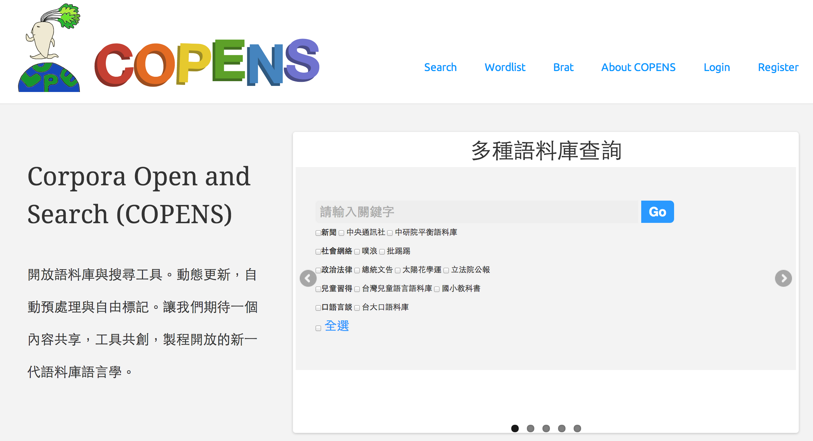
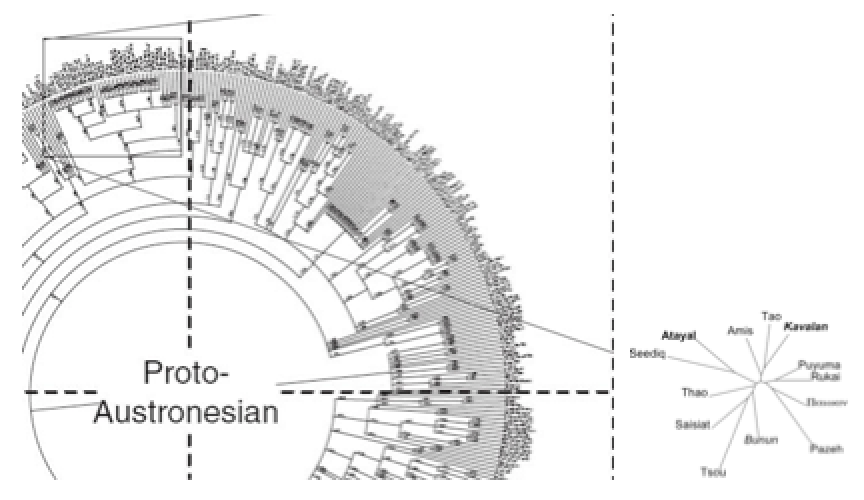
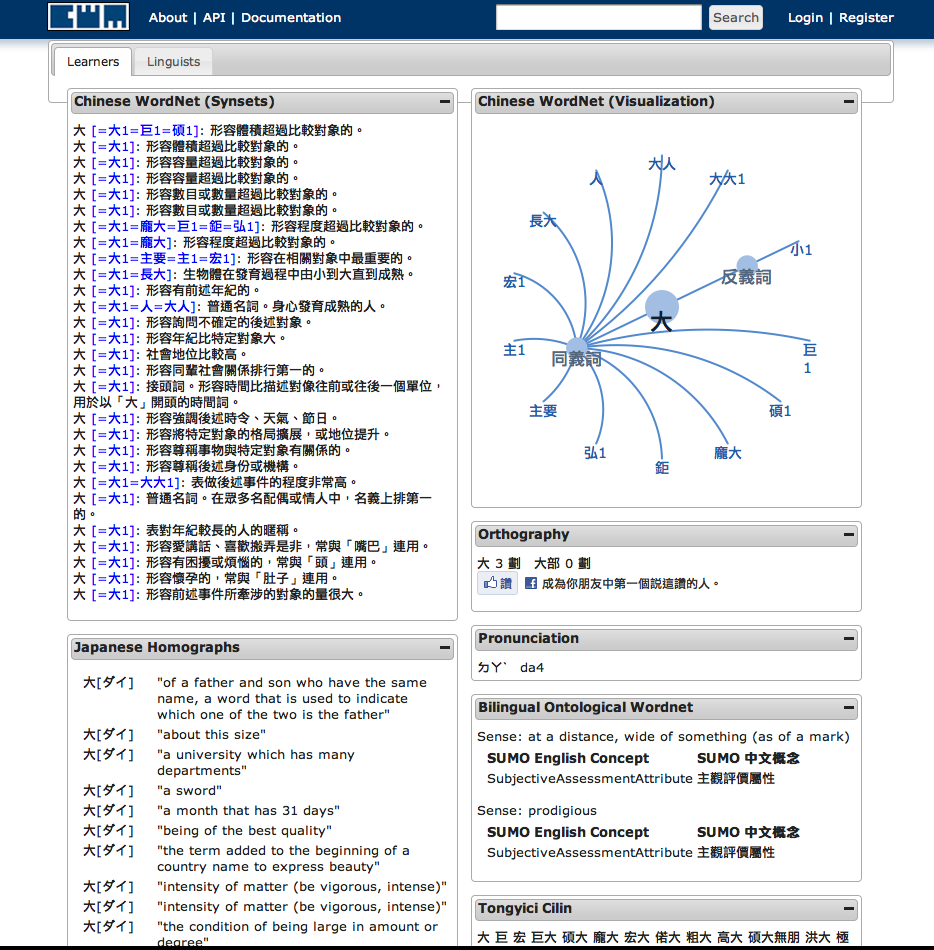
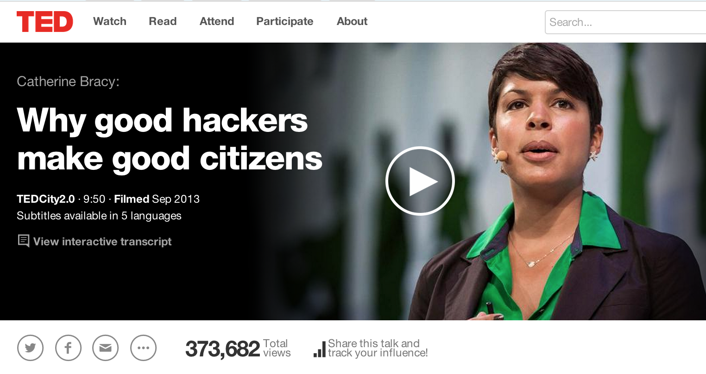

## 想法 (Two cents)

1. 語言學和開放政府的關係
2. 開放語料的意義與實作架構
3. 開放語料的未來芻議


--- bg:#FFFAF0

## 想法 (Two cents)

1. __`語言學和開放政府的關係`__
2. 開放語料的意義與實作
3. 開放語料的未來芻議


--- .dark .nobackground .quote
# 2 分鐘背景知識
### 2 minutes Linguistics


---
## 語言學是什麼? What is Linguistics ?

- 語言學要回答`語言的習得與發展`，`結構與功能`，`神經與心理機制`，`社會變異與演化過程`等。
- 經驗/計算語言學 (empirical/computational linguistics) [a.k.a. Natural Language Processing] 用電腦來幫助我們回答上述問題，並產生應用。

- (大數據中的) 語言數據（**語料**）蘊含了**文化歷史記憶，社會心理趨勢，政治輿情傾向，情緒偏好分佈，人格特質與決策行為，疾病前期徵兆等等**。 


--- 

## 語言分析與處理是資料科學的第二把刀 Linguistic analysis and Data Science

> - `Linguistic data are ubiqutous`, knowledge to be discovered, tendency to be predicted.

> - 自然語言處理 (Natural Language Processing) and 文本分析技術 (Textual Analytics) are the keys [Why? pressing `p`]

*** =pnotes
<q>
> Enormous amounts of textual information are becoming available electronically on a daily basis,...... Natural Language Processing (NLP) techniques have been playing an increasing role in extracting and managing entities and relations from text... substantially reducing the overhead of the development process.
</q>


---
## 語料是什麼 What are Linguistic Data ?


- 為了溝通與表情（情緒）達意（思維），我們所實現出來的語言資料。

- 在計算語言學（自然語言處理）的脈絡下，廣義的語料包括各項`語言資源`（字典 dictionay，詞庫 lexicon，語料庫 corpus，語法樹庫 treebank，知識本體 ontologies，等等。）


---
## 語言學與零時政府 Linguistics and Open Government

- 之間的距離沒有妳想的那麼遠。
- 數位時代下的多元與巨量趨勢，語料科學對於科學與社會的影響力正在發酵。
- 開發各種語言資訊應用，理解與推展社會進步的潛力

- 政府 >> 公民嗨客(civic hacking) >> 學界 >> 產業
> open the data >> hacking the data >> exploring the data >> data social product


---
## 想法 (Two cents)

1. 語言學和開放政府的關係
2. __`開放語料的意義與實作`__
3. 開放語料的未來芻議


---
## 台語輸入 TaigiIME: A story from A-Tsioh
### 阮若打開 MOE ê Data

> Thanks to MOE's opening of its 《臺灣閩南語常用詞辭典》I could:
- turn a small experiment into an APP
- which was downloaded 10,000 times

### How `TaigIME-android` came into existence

> As a foreign student in linguistics. I noticed that many friends were using Taiwanese (Holo) in there online messages. It was either
- directly in ㄅㄆㄇㄈ
- or in 漢字 using Mandarin sounds in ㄅㄆㄇㄈ as IME...
As a computational linguist, the second option just drove me crazy.
How inconvenient is that !?! 
Can't you just use the transcription of Taiwanese sound to input 漢字 ?!?


---
## 台語輸入 TaigiME: A story from A-Tsioh

> I had the idea, but was missing the Data.... and MOE.cc found!!
> If the MOE had selected a too restrictive licence, the APP would never had made its way up to the Google Play Store, and now with the status of downloaded more than 10.000 times ! <https://github.com/a-tsioh/TaigIME-android/>


- sadly no pull requests yet
- but quite a lot of feedback for a single man ! (I wish I had more time to spend on it)


---
## Linked Linguistic Data Movement 

[Open Linguistics] (http://linguistics.okfn.org/)


---
## LOPEN and BIGLEX 

<iframe width="60" height="50" src='assets/img/lopen.png' frameborder="0" allowfullscreen></iframe>


--- .shout #demo

# [DEMO: 開放語料系統](http://lopen.linguistics.ntu.edu.tw/copens) 



---
## BIGLEX ：萌典的學伴（學界版）

| **Module.Variable**        | **Description**                       |
|---------------------|---------------------------------------|
| `concept.sense`     | word sense number from [Chinese Wordnet, CWN](http://lope.linguistics.ntu.edu.tw/cwn2/), please [help](http://lope.linguistics.ntu.edu.tw/cwikin/)       |
| `concept.gloss`     | sense definitions from CWN    |
| `concept.relations` | lexical semantic relations      |
| `emotion.polarity`  | polarity of descriptive emotional words|
| `emotion.location`  | location collocates of emotion  |
| `emotion.cause`     | cause collocates               |
| `emotion.result`    | resulting event collocates        |
| `emotion.time`        | time collocates        |
| `frequency.asbc`      | frequency of Sinica Corpus|
| `frequency.plurk`     | frequency of Plurk Corpus       |
| `frequency.childes`   | frequency of CHILDES Corpus  |
| `frequency.ptt`       | frequency of PTT                    |

**AND MANY MORE!** modules in progress: 情緒 發展歷程 語義 使用頻率 年紀 關係 性別 教學難易 部首概念 意類 知識本體 社會心理人格 . . . . . . . . . . . . . .  


--- &interactive

## `BIGLEX`: Exploratory, Reproducible, Scaled

```{r opts.label = 'interactive', results = 'asis'}
require(googleVis)
load("./mot/mot.RData")
# head(convdata)
# head(compdata)
Modal <- gvisMotionChart(convdata, idvar="VERB", timeva="DECADE") 
print(Modal, tag ='chart')
plot(Modal) 
```


---
  
## Goals and questions to answer 
  
我們的~~理想~~長遠目標

1. 人人都可以玩（語言）科學，只要她想。
2. 人人都可以邊玩邊練功邊貢獻社會，就算她沒在想。
3. 這可能嗎？
  
<a class="btn btn-large btn-danger" rel="popover" data-content="大家轉念願意放下，理解到知識從來就不應私有化。" data-original-title="" id='example'>很抱歉，不可能。除非</a>
<a id='example' data-content='Change directory doesn't actually change the directory. It changes the shell's idea of which directory we are in' data-original-title='Note'></a>


---
## 立委問政行為: PART I 

#### 法條修正草案數前三十名立委

```{r echo = F, results = 'asis'}
require(rCharts)
legis <- read.table("./data/legis.tbl", header = TRUE)
n1 <- nPlot(freq~party, group = 'gender', 
            type = 'multiBarChart',
            data = legis            
)

n1$chart(color = c('purple', 'blue'))
n1$print('chart1')
```

> "量化數據不能代表好壞只能參考，修正草案數多不一定較好，還請點選該立委觀看其修正草案的**內容**再作論定。" <http://ly.g0v.tw/>


---
## 表格數據與文本數據 Structured and un-structured data

* Data 有很多類型。

* 文本內容的深度分析可以增強信服力。


--- 
## 立委問政行為: PART II


```{r, opts.label = 'shiny'}

slidifyUI(
  sidebarPanel(
    selectInput('sex', 'Choose Sex', c('Male', 'Female')),
    selectInput('type', 'Choose Type',
      c('multiBarChart', 'multiBarHorizontalChart')
    )
  ),
  mainPanel(
    tags$div(id = 'nvd3plot', class='shiny-html-output nvd3 rChart')
  )
)
```


---
## 立委問政行為: PART III

> 國會測謊器：文本，論述，表情與政治 （無誠勿入）

> (語音，文本，多模態，言談語用，語言心理)

<iframe width="60" height="50" src='assets/img/microexpressions-lie-to-me.jpg' frameborder="0" allowfullscreen></iframe>


--- bg:#FFFAF0

## 想法 (Two cents)

1. 語言學和開放政府的關係
2. 開放語料的意義與實作
3. __`開放語料的未來芻議`__


---
## 從「還文於民」到「還語於民」

* 原視，公視，客語台影音文稿。
* 中央通訊社新聞。
* 各式公文宣導手冊。
* (以 NPR API 為例)


---
## 給出愈多，得到愈多

### 從基本詞彙到台灣南島語言族譜 (Austronesian linguistic phylogenetics)





---
## 萌典學界版 

* 從詞典(dictionary) 詞庫 (lexicon) 詞網 (lex.network) 詞雲 (lex.cloud)




---
## 結論：信願行 Conclusion


* 

* Bridge the gap between the labs and the people !

* 眾籌眾包眾什麼都歡迎 Crowd (found|sourc)ing language resources for Taiwan.


---
# 謝謝大家！請幫忙！

- Slides: <http://loperntu.github.io/g0v2014lopen/>
- LOPEN project: <http://bit.ly/4lopen> 
- TaigiLex <https://g0v.hackpad.com/TaigiLex>


